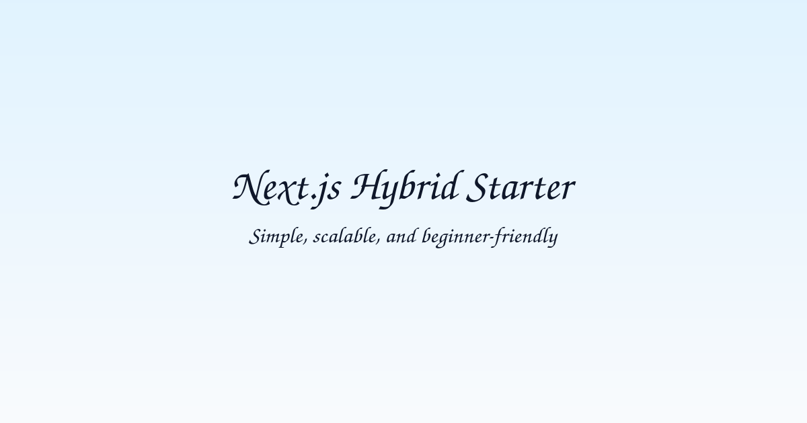
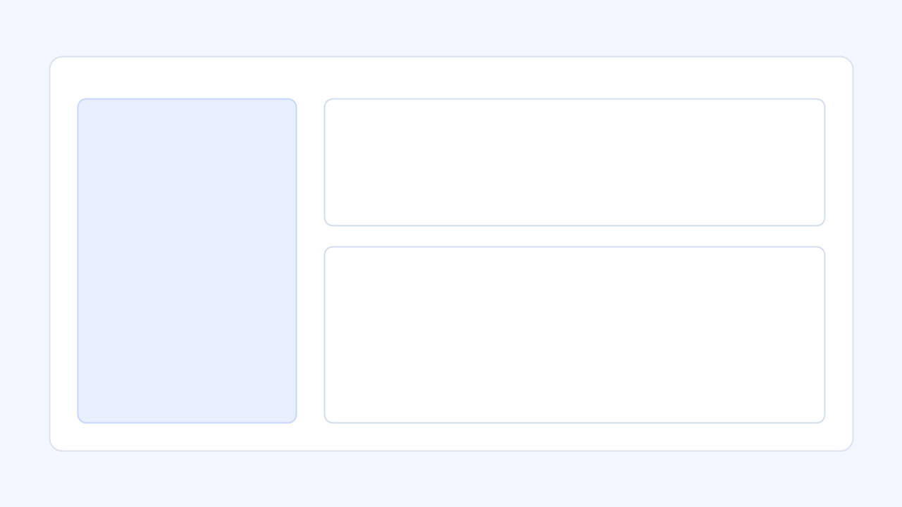
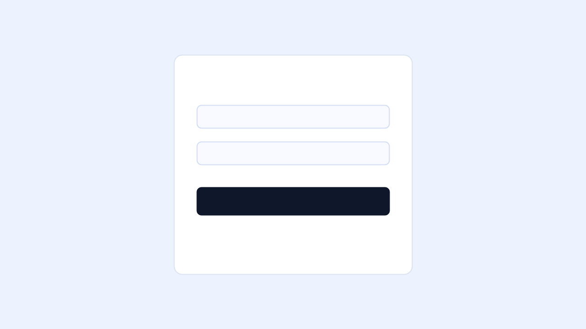

# Next.js Minimal Starter Template



**A modern, demo-ready Next.js starter for shipping dashboard-style products fast.**


## Project Name

**Next.js Minimal Starter Template**

## Tagline

**Clean architecture, instant demo login, optional MongoDB persistence.**

## Quick Start

### Prerequisites

- Node.js `>=20 <23`
- pnpm `>=10`

### 1) Install dependencies

```bash
pnpm install
```

### 2) Set up environment files

```bash
pnpm setup
```

This creates `.env` and `.env.local` from `.env.example` if they do not exist.

### 3) (Optional) Seed MongoDB demo data

```bash
pnpm seed
```

If `MONGODB_URI` is not configured, seeding is skipped automatically.

### 4) Start the app

```bash
pnpm dev
```

Open [http://localhost:3000](http://localhost:3000).

## Features

- Next.js App Router structure with clear route organization
- Cookie-based auth flow (`login`, `register`, `me`, `logout`)
- Protected dashboard route with session-aware UI
- Modular feature slices: `auth`, `user`, `project`, `task`
- Built-in demo mode with instant sign-in credentials
- Optional MongoDB support with in-memory fallback
- Seed script for auth users and sample collections
- Lightweight i18n-ready message file structure (`src/i18n/messages`)

## Folder Structure

```text
.
├── public/
│   └── assets/                # Banner, logo, and screenshot images
├── scripts/
│   ├── setup.mjs              # Creates .env/.env.local from .env.example
│   ├── seed.mjs               # Seeds demo users/projects/tasks in MongoDB
│   └── start.mjs              # Production start wrapper
├── src/
│   ├── app/                   # App Router pages + API routes
│   │   └── api/v1/auth/       # Auth endpoints (login/register/me/logout)
│   ├── components/common/     # Shared UI components
│   ├── i18n/messages/         # Localization message files
│   ├── lib/                   # Core runtime utilities (auth, env, db, logger)
│   ├── modules/               # Feature modules (auth, user, project, task, demo)
│   ├── services/              # Shared service helpers (API client)
│   └── styles/                # Global styles
├── .env.example
├── next.config.ts
├── package.json
└── README.md
```

## Demo Credentials

Use either account to sign in:

| Role | Email | Password |
|---|---|---|
| Admin | `admin@example.com` | `admin123` |
| User | `user@example.com` | `user123` |

Notes:
- These credentials work in demo mode (in-memory users).
- They are also inserted by `pnpm seed` when MongoDB is configured.

## Screenshots

### Dashboard



### Login



## Available Scripts

```bash
pnpm dev      # Start development server
pnpm build    # Build for production
pnpm start    # Start production server
pnpm setup    # Generate local env files from .env.example
pnpm seed     # Seed demo collections (requires MONGODB_URI)
```

## Environment Variables

```env
NEXT_PUBLIC_APP_NAME=Next.js Minimal Starter
MONGODB_URI=
MONGODB_DB_NAME=nextjs_starter_template
AUTH_SESSION_SECRET=dev-only-secret
```

For production, use a strong `AUTH_SESSION_SECRET` and secure MongoDB credentials.
